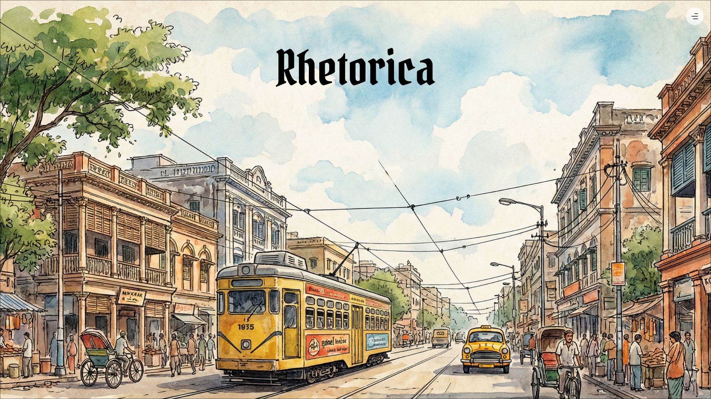

# Rhetorica



This project is perfectly remake of the original Rhetorica landing page (https://rhetorica.tint.edu.in/). Every detail, from the smooth visual animations, map tracking to the responsive layout—look and feels same like the original website.

---

## 🛠️ Tech Stack

This project is built using a modern frontend stack chosen for smooth animations and performance:

- **Next.js** – Runs the app and handles page routing
- **Tailwind CSS** – Classes based CSS for faster development
- **Framer Motion** – Powers smooth animations and scroll reveals
- **Swiper** – Creates the 3D rotating image slider

---

## Run It Locally

Follow these quick steps to get the project running on your computer:

### 1. Clone the project

```bash
git clone https://github.com/isayan24/Rhetorica-landing.git
cd Rhetorica-landing
```

### 2. Install packages

```bash
npm install
```

### 3. Start the app

```bash
npm run dev
```

### 4. View in browser

Open [http://localhost:3000](http://localhost:3000) to see it live.
